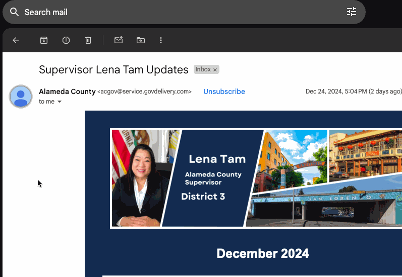

# better gmail

MIT License

FireFox extension.

[clickToFilter.js](./src/clickToFilter.js) - Click a Gmail profile image to filter by all conversations with that subject:



# setup:

First: `npm i`

Then:
- activate src watching: `npm build`
- run web-ext (browser): `npm run start`

Others: 
```
Lifecycle scripts included in gmail-extension@1.0.0:
  start
    web-ext run
  publish
    webpack --no-watch --mode production && web-ext build --overwrite-dest

available via `npm run-script`:
  build
    webpack
  check
    prettier . --check
  fix
    prettier . --write
  clean
    rm -rf  dist/ web-ext-artifacts/
```

Create asset for publishing:
```
npm run publish
```
